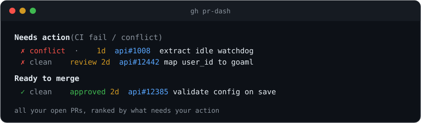

<div align="center">



<h1>gh pr-dash</h1>

<p><strong>All your open pull requests, across every repo, ranked by what needs your action.</strong></p>

<p>
  <a href="https://github.com/kobbikobb/gh-pr-dash/actions/workflows/ci.yml"></a>
  <a href="https://github.com/kobbikobb/gh-pr-dash/releases/latest"></a>
  
  
</p>

</div>

No LLM, no config, no state — deterministic, and ships as one precompiled binary.

```
Needs action — CI fail / conflict (2)
  ✗ clean    conflict     1d api   extract idle watchdog into run-watchdog    https://github.com/me/api/pull/1008
  ✗ clean    clean        2d api   map user_id from transactions to goaml (1) https://github.com/me/api/pull/12442

Ready to merge (1)
  ✓ clean    clean        2d api   Validate regulator config on save (1)       https://github.com/me/api/pull/12385
```

Each row: **CI** (`✓` pass `✗` fail `•` pending), **merge** state, **repo**, **idle** days, title (with comment count), and the full PR URL — plain text so it stays cmd-clickable, even through tmux.

## Install

```bash
gh extension install kobbikobb/gh-pr-dash
```

Requires [`gh`](https://cli.github.com), authenticated (`gh auth login`) — the extension reuses gh's auth.

## Use

```bash
gh pr-dash               # all your open PRs, ranked
gh pr-dash --org my-org  # scope to one org/owner
gh pr-dash --json        # raw JSON rows (for scripts)
gh pr-dash 50            # cap at 50 PRs (default 100)
```

## Ranking

Six tiers, most-stale-first within each:

| Tier | Meaning |
|---|---|
| **Needs action** | CI failing or merge conflict |
| **Ready to merge** | approved, CI green, no conflicts |
| **Waiting on CI** | approved but CI still running |
| **Waiting on review** | everything else that's open |
| **Drafts** | draft PRs |
| **Recently merged** | merged in the last 24 h |

Review status honors a standing approval or changes-request as well as `reviewDecision`, which is empty in repos that don't *require* review.

## Development

```bash
make test       # go test ./...
make lint       # gofmt check + go vet
make install    # build and install locally
make uninstall  # remove the local extension
```

Tagging `vX.Y.Z` builds cross-platform release binaries via [`cli/gh-extension-precompile`](https://github.com/cli/gh-extension-precompile).

## License

MIT
